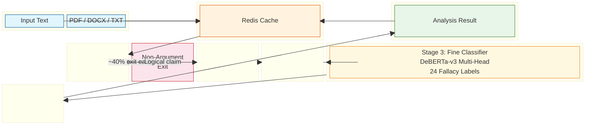
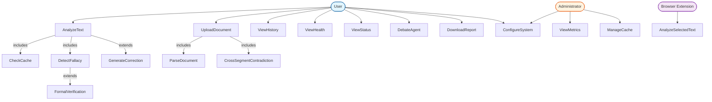
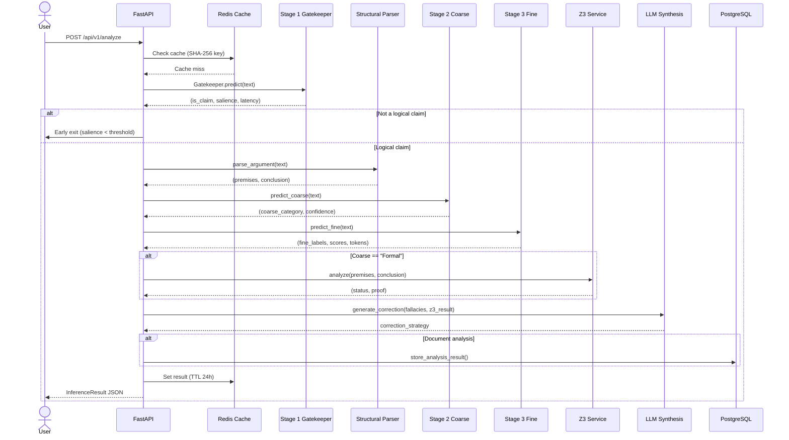
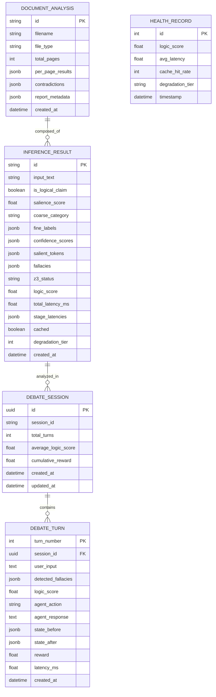

# Chapter 3: System Design

## 3.1 System Architecture Overview

LogiScan employs a **4-stage neuro-symbolic pipeline** architecture with early-exit optimization. Each stage addresses a specific sub-problem: determining whether text contains a logical claim, identifying the broad fallacy category, pinpointing the exact fallacy type, and performing formal verification with explanation generation.

### Block Diagram of the Proposed System

### Degradation Ladder

When resources are constrained, the system degrades gracefully through four tiers:

| Tier | Stage 1 | Stage 2/3 | Stage 4 (Z3) | Stage 4 (LLM) |
|---|---|---|---|---|
| **0** (Full) | ONNX CPU | GPU 4-bit | Z3 binary | Local SmolLM2 |
| **1** | ONNX CPU | ONNX CPU | Z3 binary | Local SmolLM2 |
| **2** | ONNX CPU | ONNX CPU | Z3 binary | HF API |
| **3** | ONNX CPU | ONNX CPU | Regex-only | Rule template |

---

## 3.2 Use Case Diagram

---

## 3.3 Sequence Diagram — Full Pipeline Flow

---

## 3.4 Class Diagram

```mermaid
classDiagram
    class GatekeeperService {
        -_model: AutoModel
        -_tokenizer: AutoTokenizer
        -_ort_session: InferenceSession
        -_use_onnx: bool
        -_use_ml: bool
        +predict(text: str) tuple
        -_load() GatekeeperService
        -_ml_predict(text: str) tuple
        -_heuristic_predict(text: str) tuple
    }

    class UnifiedClassifier {
        -_model: DebertaV3MultiHead
        -_tokenizer: AutoTokenizer
        +predict_coarse(text: str) tuple
        +predict_fine(text: str) tuple
        +load_model(path: str)
    }

    class DebertaV3MultiHead {
        -deberta: AutoModel
        -pooler: Linear
        -coarse_head: Linear
        -fine_head: Linear
        +forward(input_ids, attention_mask) dict
    }

    class Z3Service {
        -_solver_path: str
        +analyze(text: str) Z3Result
        -_extract_logical_structure_regex(text) tuple
        -_build_smt_regex(premises, conclusion) tuple
        -_run_z3(script: str) tuple
    }

    class StructuralParserService {
        +parse_argument(text, is_claim, use_llm) ArgumentIntelligenceResult
        -_extract_regex(text) tuple
        -_infer_reasoning_type(text, premises, conclusion) str
    }

    class LLMSynthesisService {
        -_model: AutoModelForCausalLM
        +generate(fallacies, z3_context) str
        +verify_fallacy(fallacy_type, text) bool
        +generate_unified_breakdown(result) list
    }

    class PipelineOrchestrator {
        +analyze(text, skip_cache, history) InferenceResult
        -_run_stage1(text) Stage1Result
        -_run_stage2(text) Stage2Result
        -_run_stage3(text) Stage3Result
        -_run_stage4(result) InferenceResult
        -_extract_quote_offline(text, spans, saliency) tuple
    }

    class CacheService {
        -_redis: Redis
        +get(key: str) dict
        +set(key: str, value: dict)
        +is_available: bool
    }

    class DeviceManager {
        -_device: torch.device
        +get_torch_device() torch.device
        +get_stage_target(stage) ExecutionTarget
        +cuda_healthy() bool
    }

    class InferenceResult {
        +version: str
        +input_text: str
        +is_logical_claim: bool
        +salience_score: float
        +coarse_category: str
        +fine_labels: list
        +confidence_scores: list
        +salient_tokens: list
        +fallacies: list
        +z3_status: str
        +correction_strategy: str
        +logic_score: float
        +total_latency_ms: float
    }

    class ContradictionDetector {
        +detect(segments: list) list
        -_lexical_contradiction(s1, s2) bool
        -_z3_contradiction(s1, s2) bool
    }

    PipelineOrchestrator --> GatekeeperService
    PipelineOrchestrator --> UnifiedClassifier
    PipelineOrchestrator --> Z3Service
    PipelineOrchestrator --> LLMSynthesisService
    PipelineOrchestrator --> StructuralParserService
    PipelineOrchestrator --> CacheService
    PipelineOrchestrator --> ContradictionDetector
    UnifiedClassifier --> DebertaV3MultiHead
    PipelineOrchestrator ..> InferenceResult
    DeviceManager --> UnifiedClassifier
    DeviceManager --> LLMSynthesisService
```

---

## 3.5 ER Diagram — Data Model

### Data Dictionary

**Table: `inference_results`** (cached in Redis, optionally persisted)

| Column | Type | Description |
|---|---|---|
| `id` | VARCHAR(64) PK | SHA-256 hash of input text |
| `input_text` | TEXT | Sanitized input text |
| `is_logical_claim` | BOOLEAN | Stage 1 gatekeeper output |
| `salience_score` | FLOAT | Probability of logical claim (0–1) |
| `coarse_category` | VARCHAR(32) | One of 5 coarse categories |
| `fine_labels` | JSONB | Top-3 fine-grained fallacy labels |
| `confidence_scores` | JSONB | Corresponding confidences |
| `salient_tokens` | JSONB | Token-level attribution scores |
| `fallacies` | JSONB | Unified fallacy breakdown array |
| `z3_status` | VARCHAR(16) | sat, unsat, unknown, or skipped |
| `correction_strategy` | TEXT | Human-readable explanation |
| `logic_score` | FLOAT | Composite health score (0–1) |
| `total_latency_ms` | FLOAT | End-to-end latency |
| `stage_latencies` | JSONB | Per-stage latency breakdown |
| `cached` | BOOLEAN | Whether from cache |
| `degradation_tier` | INTEGER | 0–3 degradation level |
| `created_at` | TIMESTAMP | Analysis timestamp |

**Table: `debate_sessions`**

| Column | Type | Description |
|---|---|---|
| `id` | UUID PK | Unique session identifier |
| `session_id` | VARCHAR(64) | Client-provided session key |
| `total_turns` | INTEGER | Number of debate turns |
| `average_logic_score` | FLOAT | Mean logic score across turns |
| `cumulative_reward` | FLOAT | Total RL reward accumulated |
| `created_at` | TIMESTAMP | Session creation time |
| `updated_at` | TIMESTAMP | Last turn timestamp |

**Table: `debate_turns`**

| Column | Type | Description |
|---|---|---|
| `turn_number` | INTEGER | Sequential turn number (PK) |
| `session_id` | UUID FK | Reference to debate session |
| `user_input` | TEXT | User's argument text |
| `detected_fallacies` | JSONB | Fallacies detected in this turn |
| `logic_score` | FLOAT | Logic health score (0–1) |
| `agent_action` | VARCHAR(32) | RL agent action taken |
| `agent_response` | TEXT | Generated counter-argument |
| `state_before` | JSONB | POMDP state before action |
| `state_after` | JSONB | POMDP state after action |
| `reward` | FLOAT | RL reward for this turn |
| `latency_ms` | FLOAT | Processing time |
| `created_at` | TIMESTAMP | Turn timestamp |

---

## 3.6 Hardware and Software Requirements

### Development Requirements

| Component | Requirement | Reason for Selection |
|---|---|---|
| **CPU** | x86-64 with AVX2 support | ONNX Runtime and Z3 solver require AVX2 for optimal performance. PyTorch CPU inference benefits from vectorized instructions. |
| **GPU** | NVIDIA GPU with ≥4 GB VRAM (CUDA Compute 7.0+) | DeBERTa-v3 (560M params) requires GPU for interactive-speed inference. 4-bit NF4 quantization via bitsandbytes enables the full model to fit within 4 GB VRAM. |
| **RAM** | 16 GB | Training and inference with large language models (SmolLM2-1.7B) requires substantial memory for tokenization, attention computation, and intermediate activations. |
| **Storage** | 5 GB free (SSD recommended) | Model weights (~2 GB for all stages), datasets (~500 MB), and Python dependencies (~1.5 GB) plus build artifacts. SSD reduces model loading time. |
| **Network** | Internet connection (development only) | Model downloads from HuggingFace Hub and package installation. All inference can run fully offline after initial setup. |

### Production Deployment Requirements (Docker)

| Component | Requirement | Reason |
|---|---|---|
| **CPU** | 2 cores minimum | Each pipeline stage runs on separate threads. Nginx reverse proxy and Redis also compete for CPU. |
| **RAM** | 4 GB minimum | Containerized services: Redis (~100 MB), Nginx (~50 MB), LogiScan backend with ONNX inference (~3 GB), plus OS overhead. |
| **GPU** | Optional, ≥4 GB VRAM if used | Without GPU, all stages fall back to ONNX CPU. With GPU, full pipeline latency drops from ~17 s to ~1.5 s. |
| **Storage** | 10 GB | Docker images (Python 3.12 base + Node 22 build stage), model files, log files. |
| **Network** | 80/TCP (HTTP), 8000/TCP (API) | Nginx serves on port 80 proxying to the backend on 8000. |

### Software Stack

| Layer | Technology | Version | Justification |
|---|---|---|---|
| **Backend Framework** | FastAPI | 0.139.2 | Async-native, automatic OpenAPI docs, Pydantic validation, high throughput via Uvicorn ASGI server. |
| **ML Framework** | PyTorch | 2.13.0 | Industry-standard deep learning framework with dynamic computation graphs, ONNX export support, and HuggingFace Transformers integration. |
| **Transformer Library** | HuggingFace Transformers | 5.14.1 | Pre-trained model hub, unified API for loading/configuring models, tokenizer alignment, and training utilities. |
| **ONNX Runtime** | onnxruntime | 1.27.0 | CPU-optimized inference with no Python GIL overhead. Enables sovereign offline inference without GPU dependency. |
| **4-bit Quantization** | bitsandbytes | 0.49.2 | NF4 quantization reduces model memory footprint by 4× while preserving >98% relative accuracy. Enables consumer GPU deployment. |
| **Symbolic Solver** | Z3 | 5.0.0 | Industry-standard SMT solver from Microsoft Research. Provides deterministic formal verification that neural approaches cannot match. |
| **LLM** | SmolLM2-1.7B-Instruct | — | Compact instruction-tuned model suitable for local generation of correction strategies. 1.7B params fits in 4-bit on consumer GPUs. |
| **Cache** | Redis | 7-alpine | In-memory key-value store with built-in TTL expiration. Sub-millisecond cache lookups reduce latency for repeated analyses. |
| **Database** | PostgreSQL 16 + asyncpg | — | Production-grade relational database for debate session persistence. Async driver avoids blocking the event loop. |
| **Frontend** | React 19 + TypeScript 5.8 + Vite 8 | — | Modern SPA framework with fast HMR, tree-shaking. TypeScript ensures type safety across the UI codebase. |
| **Frontend Charts** | Recharts | — | Composable charting library built on React components. Used for the Health dashboard logic score trend. |
| **Reverse Proxy** | Nginx | 1.27-alpine | Production-grade HTTP server, reverse proxy, and static file serving. Handles TLS termination, rate limiting, and request buffering. |
| **Containerization** | Docker + Docker Compose | — | Reproducible builds across environments. Multi-stage Dockerfile separates build and runtime dependencies. |
| **Testing** | pytest, vitest | — | pytest (async support) for Python backend, vitest (native ESM, jsdom) for frontend component testing. |

### Special Hardware Considerations

No special hardware (sensors, microcontrollers, or embedded devices) is required. The system is a pure software solution designed for standard server, desktop, or cloud infrastructure.

The choice of **NVIDIA GPU with ≥4 GB VRAM** is driven by the memory requirements of the DeBERTa-v3 unified classifier (560M parameters). At full precision (FP32), this model requires ~2.2 GB. With 4-bit quantization, memory drops to ~600 MB for the model plus ~200 MB for activations, comfortably fitting within 4 GB alongside SmolLM2-1.7B in 4-bit (~850 MB). On systems without a GPU, the ONNX CPU fallback provides inference at reduced speed but identical accuracy.
