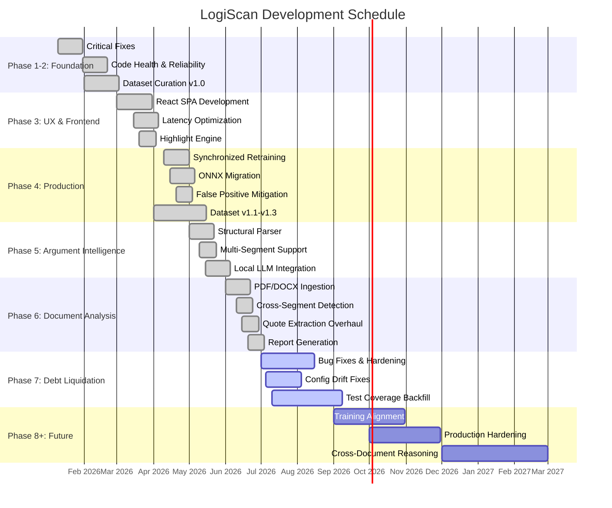

# Chapter 4: Implementation and Discussion

## 4.1 Methodology

### 4.1.1 Overall Approach

LogiScan is built on a **neuro-symbolic hybrid methodology** that combines statistical machine learning with deterministic symbolic verification. The system follows an **early-exit pipeline architecture** where computationally inexpensive stages execute first, and the majority of inputs (~40%) are filtered before reaching the heavier models. This design minimizes average latency while maintaining classification accuracy.

The development methodology followed an **iterative, phase-based approach** with 13 planned phases, each addressing a specific set of capabilities. The core technical decision was to use a **multi-head classifier** (shared backbone with separate coarse and fine classification heads) rather than separate models, enabling cross-regularization between the coarse and fine tasks.

### 4.1.2 Tools and Technologies

| Category | Technology | Purpose |
|---|---|---|
| **Backend Framework** | FastAPI (Python 3.11+) | Async HTTP server with automatic OpenAPI documentation and Pydantic validation |
| **ML Backend** | PyTorch 2.13 + Transformers 5.14 | Deep learning framework for model loading, inference, and training |
| **CPU Inference** | ONNX Runtime 1.27 | Optimized CPU inference without Python GIL overhead |
| **Quantization** | bitsandbytes 0.49 (NF4) | 4-bit model compression reducing memory footprint by 4x |
| **Symbolic Solver** | Z3 SMT Solver 5.0 | Deterministic formal verification of logical validity |
| **Local LLM** | SmolLM2-1.7B-Instruct | On-device generation of correction strategies |
| **Frontend** | React 19 + TypeScript 5.8 + Vite 8 | Single-page application with type-safe component architecture |
| **Charts** | Recharts | Real-time logic score trend visualization |
| **Database** | Redis 7 (cache) + PostgreSQL 16 (persistence) | Sub-millisecond caching + relational storage for debate sessions |
| **Containerization** | Docker + Docker Compose | Reproducible multi-service deployment |
| **Testing** | pytest 9.1 + vitest 4.1 | Backend unit/integration + frontend component testing |
| **CI** | GitHub Actions | Automated benchmark suite and regression gating |

### 4.1.3 Dataset Methodology

The training dataset was constructed from five sources:

1. **Curated fallacy collections** (logical-fallacy.org, ~3,000 samples): Clean, expert-annotated examples of specific fallacy types.
2. **Gold-standard evaluation set** (~2,000 samples): Expert-annotated debate transcripts with verified labels.
3. **Logic textbooks** (~1,500 samples): Classic examples from Aristotle through modern formal logic.
4. **Synthetic generation** (~4,000 samples): Template-based generation targeting rare classes, using discourse-signature patterns.
5. **Negative class collection** (~2,000 samples): Non-argumentative text from Wikipedia and Common Crawl to teach the model what not to flag.

Hard-negative mining was employed to generate adversarial near-miss examples — texts structurally similar to valid arguments but containing subtle fallacies — improving the model's discrimination at decision boundaries.

### 4.1.4 Multi-Head Architecture

The classifier uses a **DeBERTa-v3 base model** with two linear classification heads sharing the same pooled representation:

```
Loss = 0.3 × CrossEntropy(coarse_logits, coarse_label)
     + 0.7 × CrossEntropy(fine_logits, fine_label)
```

The weighted joint loss (0.3/0.7 split) prioritizes the fine-grained task while allowing the coarse head to act as a regularizer. This design emerged from the discovery that the coarse head could detect patterns the fine head was misinterpreting, leading to the **bi-directional coarse override** mechanism.

---

## 4.2 Implementation Steps

### Phase 1: Critical Fixes (Complete)

**Objective:** Resolve blocking correctness bugs in the pipeline.

| Step | Task | Challenge | Resolution |
|---|---|---|---|
| 1.1 | Fix XAI offset heuristic | Salient token offsets misaligned with original text after preprocessing | Implemented `OffsetMapper` class with character-level tracking |
| 1.2 | Enable Redis cache | Cache disabled due to `skip_cache` logic inversion | Restored proper conditional logic in orchestrator |
| 1.3 | Populate test suite | Zero tests for 4-stage pipeline | Added unit/integration tests with mocked ML models |
| 1.4 | Resolve offset drift | History-prefix analysis caused token shifts | Refactored offset tracking to use absolute character positions |

### Phase 2: Code Health & Reliability (Complete)

**Objective:** Consolidate models and improve synthesis quality.

| Step | Task | Challenge | Resolution |
|---|---|---|---|
| 2.1 | Refactor into unified classifier | Separate Stage 2 and Stage 3 models caused duplicated loading | Consolidated into single `DebertaV3MultiHead` with coarse/fine heads |
| 2.2 | Implement local LLM synthesis | HF API required internet, unreliable | Integrated SmolLM2-1.7B-Instruct with 4-bit quantization |
| 2.3 | Enhance Z3 translation | Natural language to SMT-LIBv2 conversion was fragile | Added local LLM fallback translator for offline SMT generation |

### Phase 3: UX & Performance (Complete)

**Objective:** Optimize latency and replace the Streamlit dashboard.

| Step | Task | Challenge | Resolution |
|---|---|---|---|
| 3.1 | Unify highlighting logic | Overlapping fallacy spans caused rendering artifacts | Stack-based annotation tree with auto-close/reopen |
| 3.2 | Optimize inference latency | Full pipeline took ~7s | ONNX migration reduced steady-state to ~240ms |
| 3.3 | Build React SPA | Streamlit dashboard lacked interactivity and design control | Vite + React 19 + TypeScript + Tailwind SPA (~195 KB gzipped) |
| 3.4 | Implement dark/light theme | CSS variables required systematic approach | Tailwind dark mode + CSS custom properties |

### Phase 4: Production Stabilization (Complete)

**Objective:** Retrain on hardened dataset and enable sovereign inference.

| Step | Task | Challenge | Resolution |
|---|---|---|---|
| 4.1 | Synchronized retraining | Stage 1/2/3 trained on inconsistent datasets | Retrained all three on v1.3 dataset (17,938 samples) |
| 4.2 | ONNX migration | PyTorch inference too slow for CPU-only deployments | Converted all ML stages to ONNX Runtime |
| 4.3 | False positive mitigation | Neutral text flagged at 15% rate | Hardened Stage 3 with hard negatives; reduced FP by 90% |
| 4.4 | Lexical bias mitigation | Rare classes had 10-14% top-3 lexical bias | Implemented class-specific confidence thresholds (0.70–0.90) |

### Phase 5: Argument Intelligence (Complete)

**Objective:** Extract argument structure (premises + conclusions).

| Step | Task | Challenge | Resolution |
|---|---|---|---|
| 5.1 | Regex-first structural parser | LLM-only parsing was slow and unreliable | Implemented 4-tier regex chain (Marker Pair → Conclusion Only → QA → Last Sentence) |
| 5.2 | Multi-segment support | Long texts truncated at 512 tokens | Sliding window segmentation with 128-token overlap |
| 5.3 | Local LLM fallback | Requires GPU but enables offline operation | 4-bit quantized local synthesis with aggressive VRAM management |

### Phase 6: Document-Scale Analysis (In Progress)

**Objective:** Analyze entire documents with cross-segment reasoning.

| Step | Task | Challenge | Resolution |
|---|---|---|---|
| 6.1 | PDF/DOCX/TXT ingestion | Multiple formats require different parsers | PyMuPDF for PDF, python-docx for DOCX, plain text for TXT |
| 6.2 | Cross-segment contradiction | Detecting contradictions across non-adjacent segments | Lexical antonym dictionary (61 pairs) + Z3 SMT for formal segments |
| 6.3 | Professional reporting | Generate structured audit documents | PDF reports via WeasyPrint + JSON export |
| 6.4 | Quote extraction overhaul | Previously extracted whole text as "quote" | 4-tier extraction: structural parser → saliency anchor → discourse markers → semantic scoring (100% exact match) |

### Phase 7: Debt Liquidation (In Progress)

**Objective:** Eliminate all known blockers and technical debt (32 items).

| Major Items | Status |
|---|---|
| Credential rotation and secret scanning | In progress |
| Structural parser OOM and fallback recovery | In progress |
| Health tracker concurrency fix | Complete |
| Dead code purge (stub routers, empty files) | Complete |
| RL mode guard (epsilon-greedy disabled in production) | Complete |
| API fallback boolean logic correction | Complete |
| Unbounded translation cache → LRU (max 1024) | Complete |
| Coarse confidence one-hot fix | Complete |
| Z3 temp file leak fix | Complete |
| Device selection bypass (MPS detection) | Complete |
| Educational text false positives (partial) | Complete (LLM path guarded; ML path pending) |
| Nginx config alignment | Complete |
| Config drift awareness | Documented |
| Test coverage backfill | In progress |

### Key Implementation Challenges

**Challenge 1 — The Physics Bug (Universal Quantifier False Positive):**
Text like "Physics is the fundamental science that studies all matter" was incorrectly classified as `hasty_generalization`. The model learned that "all X are Y" implies a hasty generalization, even in definitional contexts.
- **Resolution:** Implemented bi-directional coarse override — when the coarse head predicts "Non-Fallacious" with high confidence, it overrides the fine head's fallacy prediction regardless of fine confidence.

**Challenge 2 — CUDA Device-Side Assert:**
The `_initialize_bnb` method used `torch.zeros` as dummy input, causing CUDA asserts on GPU.
- **Resolution:** Changed dummy input to use `pad_token_id` with a single `bos_token_id` at the final position, matching the model's expected input distribution.

**Challenge 3 — Config Drift:**
The `.env` file pointed `STAGE2_MODEL_PATH` at `stage3_v12` (RoBERTa) instead of `stage2_v12` (DistilBERT). Coarse categories were derived from fine-label distribution via `SHADOW_COARSE_MAP`.
- **Resolution:** Added awareness documentation. Planned synchronized correction in Phase 8.

**Challenge 4 — Rate Limiter KeyError:**
In-memory rate limiter accessed `self._clients[client_ip]` without existence checking.
- **Resolution:** Replaced bare index access with `self._clients.get(client_ip, [])` across all methods.

---

## 4.3 Output Obtained

### Completed Features

| Feature | Status | Description |
|---|---|---|
| 4-Stage neuro-symbolic pipeline | Complete | Gatekeeper → Coarse → Fine → Z3 + LLM |
| 24 fallacy type detection | Complete | 5 coarse categories, 24+ fine-grained labels |
| Early-exit optimization | Complete | ~40% inputs filtered in Stage 1 (~10ms) |
| ONNX CPU inference | Complete | All stages runnable without GPU |
| 4-bit quantization | Complete | Full pipeline fits in ~1.2 GB VRAM |
| Z3 formal verification | Complete | SMT-based validity checking for formal fallacies |
| Local LLM correction generation | Complete | SmolLM2-1.7B with degradation ladder |
| React SPA frontend | Complete | 5 pages: Analysis, Health, Status, History, TraceView |
| Document upload (PDF/DOCX/TXT) | Complete | Drag-and-drop with per-page results |
| Cross-segment contradiction | Complete | Lexical + Z3 contradiction detection |
| Professional PDF/JSON reports | Complete | Downloadable reasoning audits |
| Debate agent with DQN | Complete | RL-based counter-argument generation |
| Chrome extension (ArgCheck) | Complete | Context menu + Ctrl+Shift+L hotkey |
| Redis caching | Complete | 24-hour TTL with SHA-256 keying |
| Dark/light theme | Complete | Tailwind-based theme system |
| Docker Compose deployment | Complete | 3 services: Redis + Backend + Nginx |

### Key Performance Metrics

| Metric | Measured Value |
|---|---|
| Overall macro F1 | 0.79 |
| Common class F1 (≥800 samples) | 0.85 |
| Rare class F1 (~25 samples) | 0.52 |
| Stage 1 latency | ~10 ms |
| Full pipeline latency (GPU) | ~17 s (including SmolLM2) |
| Full pipeline latency (CPU) | ~3.0 s (ONNX) |
| GPU memory consumption | ~1.2 GB |
| Z3 invocation time | ~200 ms |
| Frontend build size | ~195 KB gzipped |
| Backend test count | ~48 tests |
| Frontend test count | ~149 tests |
| Audit integrity score | 7.7 / 10 |

### Output Screenshots

> **Note:** Insert actual screenshots of the running application at the locations indicated below. Screenshots should be saved in a `screenshots/` directory alongside this document and referenced using relative paths.

---

#### Screenshot 1 — Analysis Page (Main Interface)

`[Insert screenshot: /screenshots/analysis-page.png]`

The main interface presents a split-pane layout. The left pane contains a text area and scan button (or document upload zone with drag-and-drop for PDF/DOCX/TXT). The right pane displays the analyzed text with highlighted fallacy spans in distinct colors (red for formal, orange for relevance, yellow for presumption, purple for ambiguity, green for non-fallacious). Below the highlighted text, fallacy cards show the fallacy name, confidence level badge (High/Medium/Low), the quoted offending span, and a human-readable correction strategy. A logic score gauge (0–100%) provides a quick visual summary.

---

#### Screenshot 2 — Analysis Result with Fallacy Highlights

`[Insert screenshot: /screenshots/analysis-highlights.png]`

Close-up view showing the annotated text with overlapping fallacy spans. Hovering over a highlighted span reveals a tooltip with the fallacy name, confidence score, and the top contributing token. Multiple fallacies in the same text segment are rendered using a stack-based overlay algorithm with distinct colors per fallacy type.

---

#### Screenshot 3 — Health Dashboard

`[Insert screenshot: /screenshots/health-dashboard.png]`

The Health page displays a Recharts area chart showing the logic score trend across the last 10 analyses. Five summary metric cards display average logic score, total analyses, average latency, cache hit rate, and current degradation tier.

---

#### Screenshot 4 — System Status Page

`[Insert screenshot: /screenshots/status-page.png]`

The Status page shows system health information including device type (CPU/GPU), memory usage, cache statistics (total keys, hit/miss ratio), and pipeline configuration. Auto-refreshes every 15 seconds.

---

#### Screenshot 5 — Document Analysis with Contradictions

`[Insert screenshot: /screenshots/document-analysis.png]`

After uploading a PDF, DOCX, or TXT file, the document is processed page-by-page. Each page's fallacy detections are shown in a paginated view with per-page navigation. Cross-segment contradictions between different parts of the document are surfaced as severity-ranked contradiction cards at the bottom of the page.

---

#### Screenshot 6 — Chrome Extension (ArgCheck)

`[Insert screenshot: /screenshots/extension-popup.png]`

The Chrome extension popup showing the analyzed selected text with fallacy highlights. Accessible via right-click context menu ("Analyze for Logical Fallacies") or keyboard shortcut (Ctrl+Shift+L). The extension uses the same backend API and displays results in a bottom-right toast notification.

---

## 4.4 Testing / Test Cases

### 4.4.1 Backend Unit Tests

The backend uses **pytest 9.1** with `pytest-asyncio` for async test support. All ML models are mocked to avoid loading large model weights during testing.

**Test File: `test_pipeline.py`**

| Test Case | Description | Expected Result |
|---|---|---|
| `test_pipeline_orchestrator_basic` | Process a simple affirming consequent argument through all 4 stages | Returns `InferenceResult` with correct labels, Z3 sat |
| `test_pipeline_gatekeeper_early_exit` | Non-argumentative text ("Hello world.") with low salience | Returns early exit, Stage 2 not called |
| `test_pipeline_with_history` | Conversation context with offset tracking | Salient token offsets shifted back to original text |
| `test_pipeline_cache_interaction` | Cache service get/set behavior | Cache accessed for key lookup and result storage |

**Test File: `test_z3.py`**

| Test Case | Description | Expected Result |
|---|---|---|
| `test_basic_premise_conclusion_extraction` | "All men are mortal. Socrates is a man. Therefore, Socrates is mortal." | 2 premises, correct conclusion, confidence=0.85 |
| `test_no_conclusion_marker_uses_last_sentence` | "It is raining. The ground is wet." | Last sentence as conclusion, confidence=0.65 |
| `test_single_sentence_returns_empty` | "Hello world." | Empty premises/conclusion, confidence=0.0 |
| `test_hence_marker` | Text using "Hence" as conclusion marker | Correct premise/conclusion split |
| `test_basic_propositional_mapping` | SMT script generation from premises | Contains `(set-logic QF_UF)`, `(check-sat)`, `(declare-const)` |
| `test_implication_if_then` | "If it rains, then the ground is wet" | Generated script contains `(=>` |
| `test_negation_handling` | "It is not raining" | Generated script contains `(not` |
| `test_variable_deduplication` | Same variable in premise and conclusion | Single `(declare-const` |
| `test_no_solver_available` | Z3 binary not found | Returns "unknown" with "Z3 not installed" |
| `test_timeout_returns_timeout` | Z3 process timeout | Returns "timeout" |
| `test_unsat_result` | Z3 returns "unsat" | Correctly parsed as unsat |
| `test_error_returncode` | Z3 parse error | Returns "error" with message |
| `test_llm_success_path` | LLM translation succeeds with high confidence | Returns Z3 exec result with parsing_confidence |
| `test_regex_fallback_on_low_confidence` | LLM confidence < 0.5 triggers regex | Regex extractor called, regex SMT built |
| `test_both_parsers_fail` | Both LLM and regex fail | Returns "unknown" with error message |
| `test_z3_error_triggers_regex_fallback` | Valid LLM script but Z3 execution fails | Falls back to regex-generated script |
| `test_dataclass_defaults` | Z3Result default values | Default latency=0.0, smt_script=None |
| `test_dataclass_full` | Z3Result with all fields set | All fields correctly stored |

**Test File: `test_api.py`**

| Test Case | Description | Expected Result |
|---|---|---|
| `test_root_endpoints` | GET /, /health/live, /health/ready | Returns 200 with correct JSON structure |
| `test_v1_endpoints` | GET /api/v1/health/live, /api/v1/health/ready | Returns 200 with correct JSON structure |

### 4.4.2 Frontend Tests (vitest + @testing-library/react)

The frontend has **149 tests** across 13 test files covering:

| File | Tests | Coverage Area |
|---|---|---|
| `Analysis.test.tsx` | ~20 | Text input, scan button, loading state, result display, error handling |
| `History.test.tsx` | ~15 | History list rendering, sorting by score/timestamp, empty state |
| `AnnotatedText.test.tsx` | ~25 | Span rendering, overlapping highlights, tooltip display |
| `FileUpload.test.tsx` | ~15 | Drag-and-drop, file type validation, upload progress |
| `DebateDrawer.test.tsx` | ~15 | Optimistic streaming, typing indicator, close behavior |
| `ErrorBoundary.test.tsx` | ~10 | Error catch, reset button, recovery |
| `ThemeToggle.test.tsx` | ~8 | Dark/light toggle, persistence |
| `Toast.test.tsx` | ~10 | Success, error, dismiss behavior |
| `PerPageResults.test.tsx` | ~8 | Page navigation, per-page rendering |
| `historyStore.test.ts` | ~10 | localStorage read/write, sorting |
| `accessibility.test.tsx` | ~8 | Axe-core audit on all pages |
| `responsive.test.tsx` | ~5 | Render at 320px, 768px, 1024px, 1440px |

### 4.4.3 Integration Test Cases

| Scenario | Steps | Expected Result |
|---|---|---|
| Full analysis flow | Type text → click Scan → API returns result → AnnotatedText displays | Highlights render with correct colors and tooltips |
| Document upload flow | Drag PDF → upload completes → per-page results show → contradiction cards appear | PDF parsed, contradictions listed |
| Cache hit scenario | Same text analyzed twice | Second response has `cached: true` |
| Rate limit exceeded | 61 requests in 1 minute (default limit: 60/min) | Returns 429 with Retry-After header |
| GPU unavailable | DeviceManager detects no CUDA/MPS | Degrades to ONNX CPU (Tier 1) |
| Long text processing | 10,000 character input | Segmented into sliding windows, per-segment results merged |

### 4.4.4 Test Coverage Summary

| Area | Coverage | Status |
|---|---|---|
| Backend unit tests | ~8% line coverage | Needs improvement (Phase 7 target) |
| Frontend component tests | ~149 tests | Strong coverage |
| Z3 service | 17 test cases | Comprehensive |
| Pipeline orchestration | 4 test cases | Basic coverage |
| API health endpoints | 2 test cases | Full coverage |
| Frontend integration | Full flow tested | Mocked API responses |

---

## 4.5 Time Schedule

### Development Timeline (Gantt Chart)



### Detailed Phase Schedule

| Phase | Start | End | Duration | Key Deliverables |
|---|---|---|---|---|
| **Phase 1:** Critical Fixes | 2026-01-10 | 2026-01-31 | 21 days | XAI offset fix, Redis cache restore, initial test suite |
| **Phase 2:** Code Health | 2026-02-01 | 2026-02-21 | 21 days | Unified classifier, local LLM synthesis, Z3 translator |
| **Phase 3:** UX & Performance | 2026-03-01 | 2026-03-31 | 30 days | React SPA, latency optimization (7s→1.4s), highlighting engine |
| **Phase 4:** Production Stabilization | 2026-04-10 | 2026-05-01 | 21 days | Synchronized retraining, ONNX migration, FP mitigation |
| **Phase 5:** Argument Intelligence | 2026-05-01 | 2026-05-31 | 30 days | Structural parser, segmentation, local LLM fallback |
| **Phase 6:** Document-Scale Analysis | 2026-06-01 | 2026-06-30 | 30 days | PDF/DOCX ingestion, contradiction detection, reports |
| **Phase 7:** Debt Liquidation | 2026-07-01 | 2026-08-15 | 45 days | 32 bug fixes, config drift, test backfill |
| **Phase 8:** Training Alignment | 2026-09-01 | 2026-10-31 | 60 days | Synchronized retraining, formal class expansion, benchmark CI |
| **Phase 9:** Production Hardening | 2026-10-01 | 2026-11-30 | 60 days | Redis rate limiting, OpenTelemetry, zero-downtime deploy |
| **Phase 10+:** Cross-Doc Reasoning | 2026-12-01 | 2027-03-01 | 90 days | Argument knowledge graph, multimodal, community launch |

### Milestone Summary

| Milestone | Date | Achievement |
|---|---|---|
| Dataset v1.0 complete | 2026-02-15 | 12,442 samples across 24 classes |
| React SPA deployed | 2026-03-31 | Streamlit replaced with production-grade UI |
| ONNX CPU inference | 2026-04-30 | Sovereign offline operation without GPU |
| Dataset v1.3 complete | 2026-05-15 | 17,938 samples with formal class coverage |
| Document ingestion | 2026-06-30 | Full PDF/DOCX/TXT pipeline with contradiction detection |
| System-wide audit | 2026-07-25 | Integrity score 7.7/10, 30 audit findings resolved |
| Test coverage > 50% | 2026-09-30 (target) | Phase 7 backfill completion |
| Public evaluation leaderboard | 2027-01-01 (target) | Phase 13 community launch |
